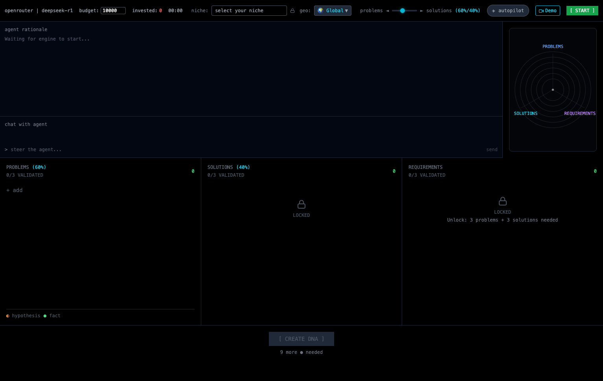
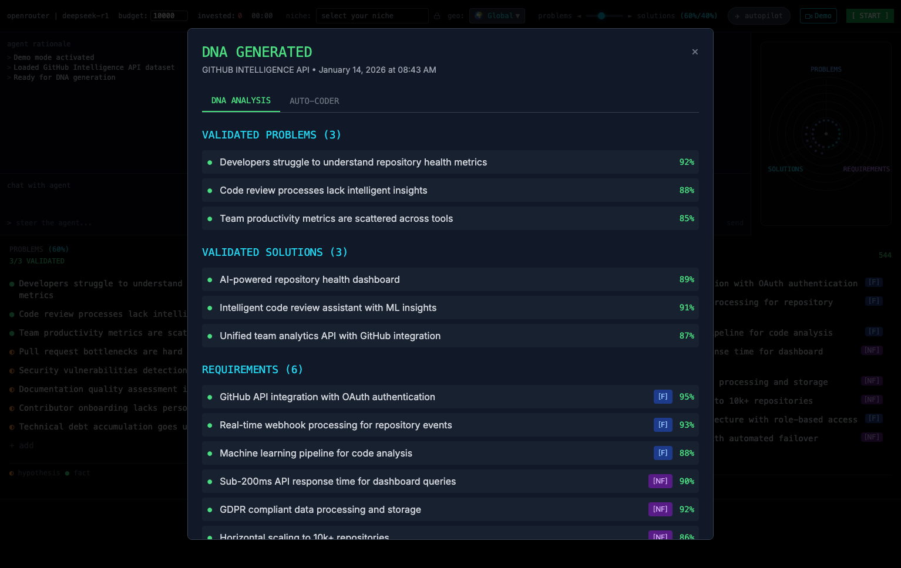
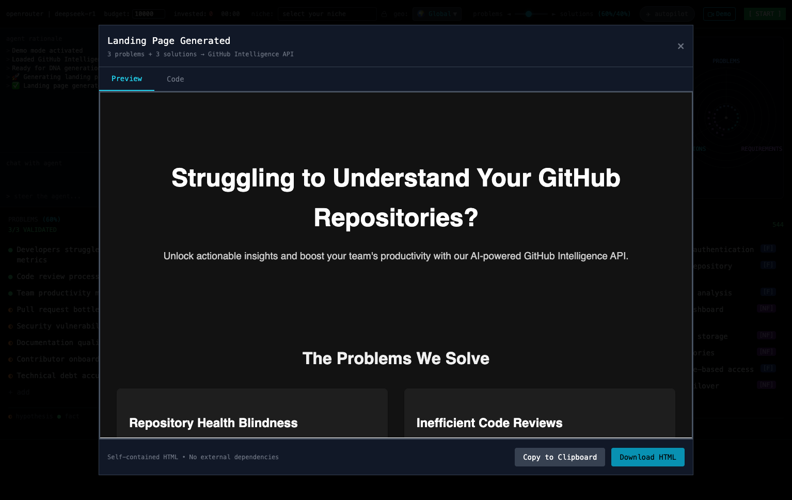
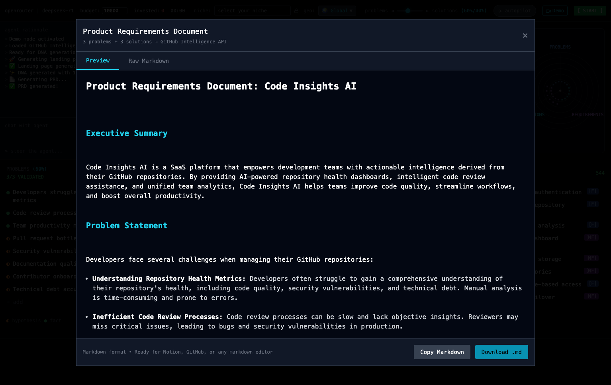

# Curatos DNA

> **From Idea to MVP in Minutes** — Select a market niche, validate it against 81 real web sources, generate a business plan, a technical PRD, and a working HTML prototype. All automated. No coding required.

[](https://nextjs.org/)
[](https://www.typescriptlang.org/)
[](https://kiro.dev)
[](LICENSE)

---

## Live Demo

> **Don't want to set up API keys?** Try the deployed version:
> **[https://kiro-hackathon-gustavo-carriconde.vercel.app](https://kiro-hackathon-gustavo-carriconde.vercel.app)**
>
> Same commit as this repo. Prepared hours before submission deadline.

## Demo Video

> **[Watch the 3-minute walkthrough](TODO_ADD_VIDEO_LINK)**

---

## What It Does

Curatos DNA takes a business idea from concept to working prototype through 6 automated stages:

| Stage | What Happens |
|-------|-------------|
| **1. Business Idea** | Select a market niche and target geography. AI generates a structured 7-pillar business description. You can edit or regenerate. |
| **2. Idea Refinement** | AI researches your idea across 8 APIs (Google, Reddit, Hacker News, FRED, Academic, Wikipedia, Wikidata, Jobs) — 81 queries total. Scores each pillar 0-100. Then refines weak areas. |
| **3. Business Plan** | Auto-generates a 4-section investor-ready plan with interactive charts and financial projections. |
| **4. PRD** | Generates a Product Requirements Document — the bridge between business analysis and technical development. Full traceability: Users -> Stories -> Requirements. |
| **5. AutoCoder** | Autonomous AI agent reads the PRD and generates a working HTML/CSS/JS landing page — your MVP prototype. |

Each stage unlocks automatically. The progress bar, scores, and research results update in real-time.

### The 7 Pillars (scored 0-100)

| Pillar | What It Measures | APIs Used |
|--------|-----------------|-----------|
| Problem Severity | Pain intensity, frequency, workarounds | Google, Reddit, Hacker News |
| Market Opportunity | TAM, adjacent markets, growth rate | Google, FRED, Academic, Wikipedia |
| Competitive Landscape | Competitor weaknesses, differentiation | Google, Reddit, HN, Wikipedia |
| Solution Fit | Problem-solution match, feature completeness | Google, HN, Academic, Reddit |
| Monetization Potential | Pricing models, unit economics | Google, Reddit, HN, FRED |
| Go-to-Market Clarity | Channel strategy, adoption readiness | Google, Reddit, HN, RemoteOK |
| Timing and Trends | Market timing, industry shifts, economics | Google, HN, FRED, Academic |

---

## Quick Start

### Prerequisites

- Node.js 18+
- Docker (for PostgreSQL)
- **OpenRouter API key** — [openrouter.ai](https://openrouter.ai) — **Paid account required.** This app makes many LLM calls across multiple models (GLM 4.7 Flash, DeepSeek Chat, Gemini Flash) tuned for efficiency, quality, and cost. Free accounts hit rate limits.
- **Serper API key** — [serper.dev](https://serper.dev) — **Required.** Powers Google web research. 2,500 free searches included.

### Setup

```bash
git clone https://github.com/carrgust/kiro-hackathon-gustavo-carriconde.git
cd kiro-hackathon-gustavo-carriconde
npm install

# Start database
docker-compose up -d
npx prisma generate
npx prisma migrate dev

# Configure API keys
cp .env.local.example .env.local
# Edit .env.local — add OPENROUTER_API_KEY and SERPER_API_KEY

# Run
npm run dev
```

Open [http://localhost:5001](http://localhost:5001) and select a niche to begin.

---

## Tech Stack

| Layer | Technology |
|-------|-----------|
| Framework | Next.js 14, TypeScript, React 18 |
| Styling | Tailwind CSS, Framer Motion |
| Charts | Recharts (6 types: pie, bar, radar, cards, timeline, donut) |
| Database | PostgreSQL + Prisma ORM |
| AI Gateway | OpenRouter (GLM 4.7 Flash, DeepSeek Chat, Gemini Flash) |
| Web Research | 8 APIs via API Machine Gun (81 parallel queries) |
| Testing | Vitest + Playwright |

---

## Architecture

```
User selects niche + geography
       |
       v
[Normalize] --> 7-Pillar Description (editable)
       |
       v
[Validate] --> 81 API calls (8 sources x 7 pillars x 3 subcategories)
       |       Scores update in real-time via polling
       v
[Refine] --> AI improves weak pillars
       |
       v
[Business Plan] --> 4 sections + interactive charts
       |
       v
[PRD] --> Users -> Stories -> Functional Reqs -> Non-Functional Reqs
       |
       v
[AutoCoder] --> Working HTML/CSS/JS landing page (MVP prototype)
```

---

## Project Structure

```
src/
  app/               # Next.js App Router + 18 API routes
  components/        # 57 React components
  lib/validation/    # 7-pillar scoring engine + API registry
  lib/research/      # 8 API integrations (Serper, Reddit, HN, FRED, OpenAlex, Wikipedia, Wikidata, RemoteOK)
.kiro/
  steering/          # Product, tech, and structure docs
  specs/             # 7 feature specifications
  prompts/           # Reusable Kiro prompts
  DEVLOG.md          # Development journal
prisma/              # Database schema (10 models)
```

---

## Built with Kiro

This project was built using [Kiro CLI](https://kiro.dev) for the **Dynamous x Kiro Hackathon 2026**.

- **Steering docs**: Product vision, technical architecture, project structure
- **Specs**: 7 feature specifications (hypothesis engine, demo mode, API machine gun, database, OpenRouter validation, PRD generator, autocoder)
- **Prompts**: 12 reusable prompts
- **DEVLOG**: 840+ lines documenting the full development journey

---

## Screenshots

| Main Dashboard | Validation | Business Plan | PRD |
|:-:|:-:|:-:|:-:|
|  |  |  |  |

---

## License

MIT — [Gustavo Carriconde](https://github.com/carrgust) — Dynamous x Kiro Hackathon 2026
